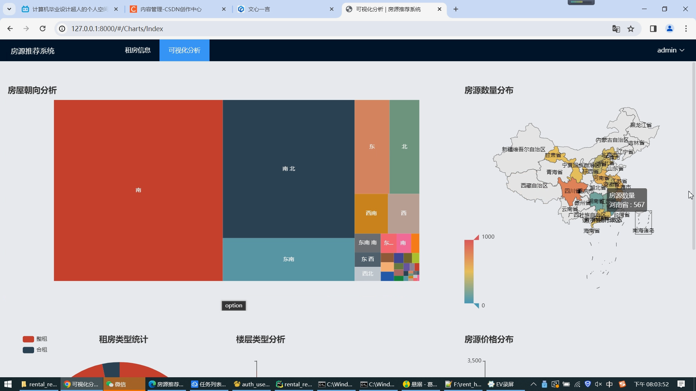
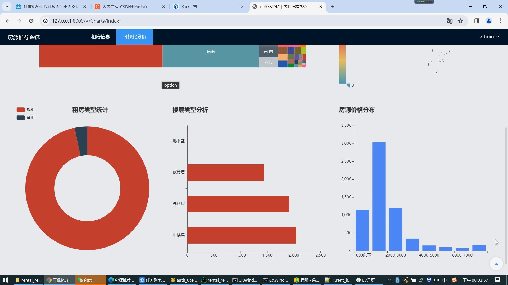
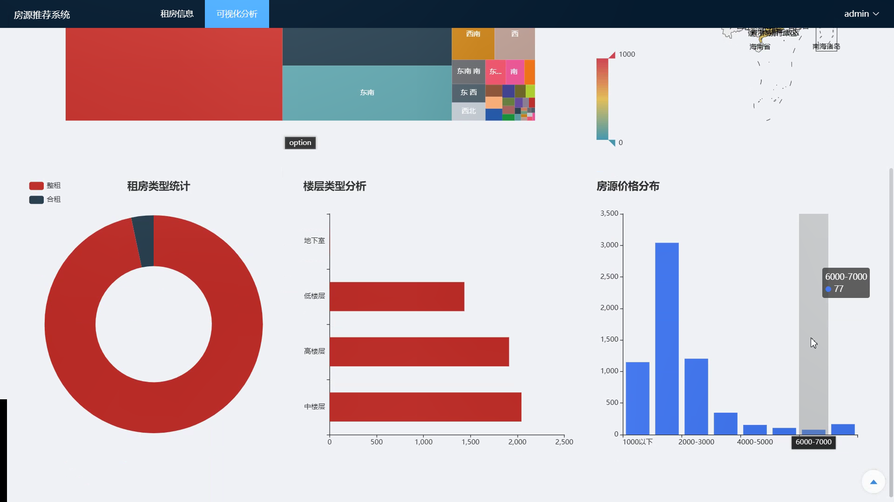
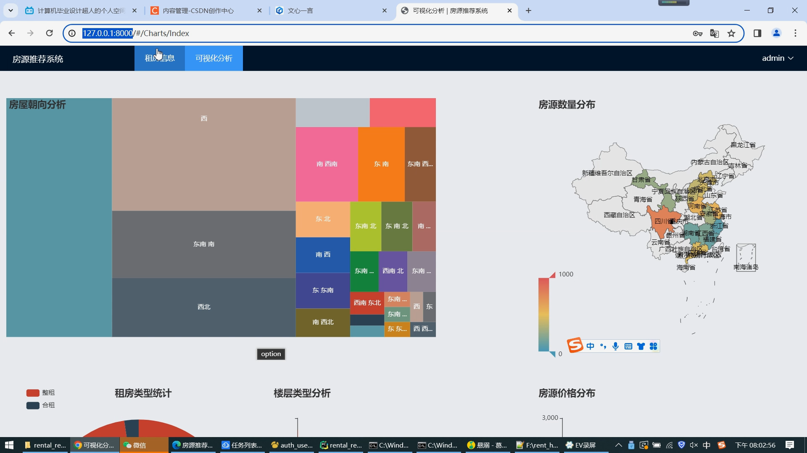
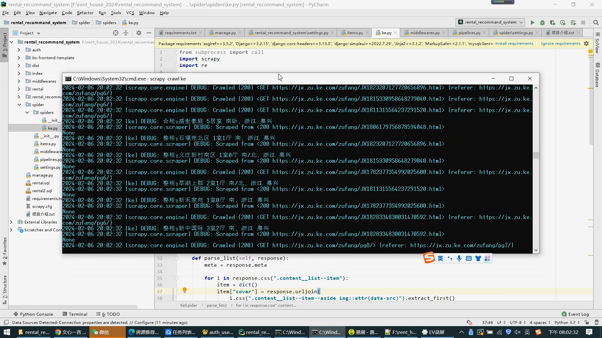
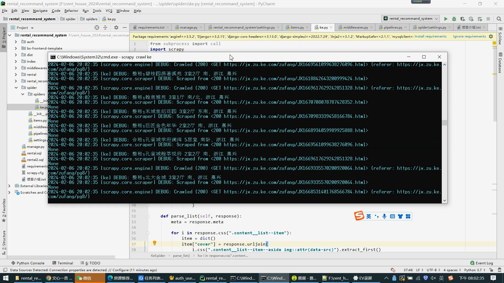
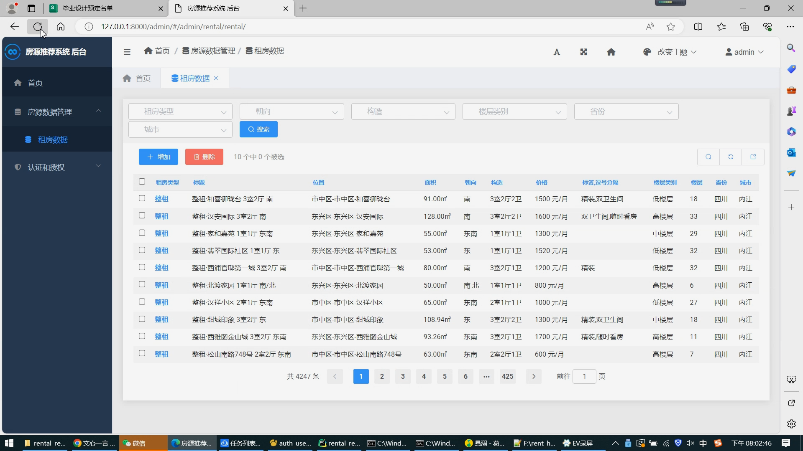

## 计算机毕业设计Python+大模型租房推荐系统 租房大屏可视化 租房爬虫 hadoop spark 58同城租房爬虫 房源推荐系统

## 要求
### 源码有偿！一套(论文 PPT 源码+sql脚本+教程)

### 
### 加好友前帮忙start一下，并备注github有偿大模型租房推荐
### 我的QQ号是2827724252或者798059319或者 1679232425或者微信:bysj2023nb

# 

### 加qq好友说明（被部分 网友整得心力交瘁）：
    1.加好友务必按照格式备注
    2.避免浪费各自的时间！
    3.当“客服”不容易，repo 主是体面人，不爆粗，性格好，文明人。

## 演示视频

https://www.bilibili.com/video/BV1FM4m117qC/

https://www.bilibili.com/video/BV1Tr421L7DX/

## 运行截图

## 用到的技术:
    1. python
    2. django后端框架
    3. django-simpleui，Django后台
    4. vue前端
    5. element-plus，vue的前端组件库
    6. echarts前端可视化库
    7. scrapy爬虫框架

## 基于大数据的租房信息推荐系统包括以下功能：

    数据爬取和清洗
    实现方法：使用Scrapy框架进行数据爬取，通过Python进行数据清洗。首先，定义网页解析器，利用XPath语法获取租房信息的相关数据（如房源价格、房屋类型、朝向、楼层等数据），再使用正则表达式对数据进行清洗。
    
    数据库设计与管理
    实现方法：使用MySQL数据库存储租房信息数据，设计表结构包括租房信息、用户信息、常用搜索关键词、用户历史搜索记录等，通过Django ORM实现对数据库的数据操作。
    
    推荐算法实现
    实现方法：使用基于协同过滤的推荐算法，根据用户过去的租房行为和喜好，从租房信息数据库中寻找类似的房屋信息，然后根据用户的个性化需求和偏好进行推荐。
    
    前后端架构设计与实现
    实现方法：使用Vue.js作为前端框架，实现网站界面的交互效果；使用Django作为后端框架，实现网站后台的功能逻辑。采用RESTful API实现前后端数据交互。
    
    可视化展示
    实现方法：使用Echarts工具实现数据可视化，并将推荐结果展示在大屏幕上，以便用户能够更直观地了解推荐信息。
    
    统计和分析
    实现方法：对租房类型、房屋朝向、楼层类型、房源价格和数量等进行统计和分析，以便为用户提供更全面、准确的租房信息。通过Python的数据分析库（如pandas等）实现数据的处理和分析。

## 论文可能的摘要：
    随着信息化水平的高速发展，租房市场越来越受到人们的青睐。然而，在庞大的租房信息中，如何让用户快速并准确地找到适合自己的房源，成为了当前市场上亟待解决的问题。
    
    本文提出了基于大数据的租房信息推荐系统的实现方案，通过利用 python、django、vue、scrapy、echarts 等技术，搭建一个全面的租房信息平台。
    
    该系统主要分为如下几个模块：信息爬取、数据处理、协同过滤算法、数据可视化以及租房信息推荐等。
    
    在信息爬取方面，本系统采用 scrapy 爬虫框架，对贝壳租房网站进行爬取，获得大量的租房信息。在数据处理方面，本系统通过对爬取的数据进行清洗、去重、筛选等操作，使其更加符合用户需求。
    
    在算法方面，本系统引入协同过滤算法，根据用户在平台上的行为、历史租房记录等因素，为用户推荐有可能满足需求的房源。
    
    在数据可视化方面，本系统利用 echarts 技术，将整合后的数据以图表形式展示在大屏幕上，帮助用户更好地了解市场情况。
    
    通过该租房信息推荐系统的实际应用效果，本文得出结论：该系统能够对租房市场进行有效的数据分析和方便的房源搜索，并且可以根据用户的行为和历史租房记录，向用户推荐更加合适的房源。同时，数据可视化也使得用户更加容易理解市场趋势，更好地做出租房决策。
    
    本文的创新点在于：将 scrapy 与协同过滤算法有机结合，并采用数据可视化的方式展示数据，从而使用户更加直观地了解市场情况。本文还指出了一些改进方向：针对租房市场的特点，可以探索一些更加精准的算法；同时，可以将推荐算法与用户购房意愿、财务状况等个人因素进行结合，提高推荐准确度。
    
    综上所述，本文提出的基于大数据的租房信息推荐系统为租房市场的进一步发展提供了有益的参考。

## 以下是基于大数据的租房信息推荐系统的论文目录框架：
    绪论
    1.1 研究背景和意义
    1.2 国内外研究现状与进展
    1.3 研究内容和目的
    1.4 研究方法和技术路线
    
    相关技术介绍
    2.1 大数据技术概述
    2.2 数据爬取和清洗技术
    2.3 协同过滤算法
    2.4 可视化技术及工具
    
    系统设计与实现
    3.1 系统需求分析与功能模块设计
    3.2 数据库设计与管理
    3.3 前后端架构设计与实现
    3.4 推荐算法实现
    
    系统测试与评估
    4.1 测试环境与测试数据
    4.2 系统功能测试
    4.3 推荐结果评估
    
    结果与分析
    5.1 系统实现效果分析
    5.2 推荐算法性能对比分析
    5.3 用户满意度分析
    
    总结与展望
    6.1 主要工作总结
    6.2 存在问题与改进方向
    6.3 未来发展展望
    
    参考文献
    
    附录

## 目录介绍:
    ├── auth 
    │   ├── __init__.py
    │   ├── admin.py
    │   ├── apps.py
    │   ├── migrations
    │   ├── models.py
    │   ├── tests.py
    │   ├── urls.py 登陆注册相关的路由配置
    │   └── views.py 登陆注册相关的代码
    ├── bs-frontend-template 
    │   ├── LICENSE
    │   ├── encrypt.js
    │   ├── index.html
    │   ├── jest.config.js
    │   ├── mock
    │   ├── package-lock.json
    │   ├── package.json
    │   ├── public
    │   ├── src 前端源代码目录，其中views目录是前端每个页面的主要代码
    │   ├── tailwind.config.js
    │   ├── test
    │   ├── tsconfig.json
    │   └── vite.config.ts
    ├── dist
    │   ├── assets
    │   └── index.html
    ├── index 
    │   ├── __init__.py
    │   ├── admin.py
    │   ├── apps.py
    │   ├── migrations
    │   ├── models.py
    │   ├── tests.py
    │   ├── urls.py 路由配置
    │   ├── utils.py
    │   └── views.py 挂起前端页面的代码
    ├── manage.py 入口文件
    ├── middlewares
    │   └── __init__.py
    │   ├── __init__.py
    ├── rental 最主要的代码目录在此
    │   ├── admin.py 租房后台管理配置
    │   ├── apps.py
    │   ├── migrations
    │   ├── models.py 租房数据库模型
    │   ├── tests.py
    │   ├── urls.py 租房相关路由配置
    │   └── views.py 租房相关所有的接口代码都在这，非常重要的一个文件
    ├── rental.sql 租房原始数据
    ├── rental_recommand_system 后端总配置目录
    │   ├── __init__.py
    │   ├── settings.py
    │   ├── urls.py 路由总配置
    │   └── wsgi.py
    ├── requirements.txt python依赖库文件
    ├── scrapy.cfg
    ├── spider 贝壳租房爬虫代码
    │   ├── __init__.py
    │   ├── items.py
    │   ├── middlewares.py
    │   ├── pipelines.py 数据入库代码
    │   ├── settings.py
    │   └── spiders 爬虫文件所在
    └── 项目介绍.txt